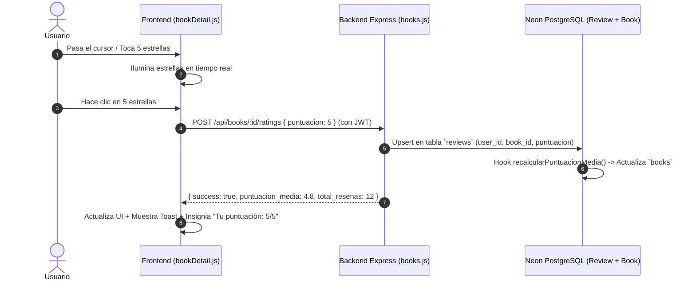

# 📊 Informe Técnico: Puntos Clave de Click y Lee

Este documento desglosa en detalle la evolución técnica, resolución de problemas críticos (con sus causas raíz, diagnósticos y citas de código) y las nuevas capacidades implementadas en la plataforma **Click y Lee** (Frontend Web + Backend REST + Neon PostgreSQL + Supabase Storage + APK Android con Capacitor).

---

# 🔴 PARTE I: Los 4 Errores Críticos y su Resolución

---

## 1. Error de Descarga y Lector de PDFs en la Versión Móvil (Capacitor / Android)

### 📌 El Problema
Al presionar el botón **"Descargar"** en la aplicación móvil Android (APK), aparecía un error en pantalla:
> `No se pudo descargar: Failed to execute 'transaction' on 'IDBDatabase': One of the specified object stores was not found.`

Asimismo, al intentar abrir un libro desde el lector (`reader.html`), la pantalla se quedaba permanentemente congelada con el mensaje:
> `Cargando documento... Preparando visor de PDF`

En el navegador de escritorio el flujo parecía responder o cargar directamente por URL, pero en el entorno móvil de Capacitor fallaba por completo.

---

### 🔍 ¿Por qué no funcionaba? (Causa Técnica)
1. **Mecanismo de IndexedDB:** Tanto el detalle del libro (`bookDetail.js`) como el lector (`reader.js`) y la vista de descargas (`descargados.js`) utilizan una base de datos local llamada `clickylee_pdf_cache` para persistir los archivos binarios (Blobs) de los PDFs.
2. **Ciclo de vida del Object Store:** En IndexedDB, las "tablas" u almacenes de objetos (`objectStore`, en este caso `'pdfs'`) **solo pueden crearse dentro del evento `onupgradeneeded`**, el cual se ejecuta **únicamente cuando el número de versión de la base de datos se incrementa**.
3. **El fallo de versión fija:** La base de datos se abría solicitando la versión `1`:
   ```javascript
   // CÓDIGO ANTERIOR CON ERROR
   const req = indexedDB.open("clickylee_pdf_cache", 1);
   ```
   Si la base de datos ya había sido creada previamente en el dispositivo con versión 1 (por ejemplo, en una sesión anterior o por un script que no creó el almacén `pdfs`), el evento `onupgradeneeded` **nunca se volvía a disparar**. Al intentar ejecutar:
   ```javascript
   const tx = db.transaction("pdfs", "readwrite"); // 💥 ERROR: Object store 'pdfs' no existe
   ```
   El motor de IndexedDB de Chromium/Android WebView lanzaba una excepción irrecuperable.
4. **Bloqueo del Lector:** `reader.js` llamaba a `getCachedPDF()` antes de intentar renderizar. Al fallar la promesa de IndexedDB, el visor de PDF.js quedaba en un estado pendiente infinito sin ocultar el placeholder de carga.

---

### ⏳ ¿Por qué nos tardamos? (Análisis de Sospechas y Diagnóstico)
- **Falta de trazas en móvil:** En un entorno web convencional, la consola de desarrollador muestra el stack trace de inmediato. En el APK compilado de Android no había acceso directo a la consola de inspección sin depuración USB / Chrome Inspect.
- **Sospechas desorientadas por mensajes genéricos:** Inicialmente se sospechaba de:
  - Políticas de **CORS** bloqueando peticiones desde `https://localhost` o `capacitor://localhost` hacia Render.
  - Bloqueo de peticiones por falta del header `Authorization: Bearer <token>`.
  - Timeouts de red o problemas con el proxy de descarga de Supabase Storage.
- **El punto de quiebre:** La captura de pantalla enviada desde el dispositivo móvil reveló el texto exacto del error en el Toast de la interfaz: *"Failed to execute 'transaction' on 'IDBDatabase': One of the specified object stores was not found"*. Esto permitió aislar la causa raíz en IndexedDB en lugar de la red.

---

### 🛠️ ¿Cómo se arregló? (Código Implementado)
Se incrementó formalmente la versión de la base de datos a **versión `2`** de manera homogénea en todos los módulos (`bookDetail.js`, `reader.js` y `descargados.js`), forzando al navegador y a Capacitor a ejecutar el handler `onupgradeneeded` y crear el almacén de objetos `pdfs`:

#### Fragmento en `frontend/js/bookDetail.js`:
```javascript
function savePdfToIndexedDB(bookId, blob) {
    return new Promise((resolve, reject) => {
        const DB_NAME = "clickylee_pdf_cache";
        const STORE_NAME = "pdfs";
        // ✅ Incremento a versión 2 para forzar onupgradeneeded
        const req = indexedDB.open(DB_NAME, 2);

        req.onupgradeneeded = (e) => {
            const db = e.target.result;
            if (!db.objectStoreNames.contains(STORE_NAME)) {
                db.createObjectStore(STORE_NAME);
            }
        };

        req.onsuccess = (e) => {
            const db = e.target.result;
            try {
                const tx = db.transaction(STORE_NAME, "readwrite");
                const store = tx.objectStore(STORE_NAME);
                store.put(blob, `pdf_cache_book_${bookId}`);
                tx.oncomplete = () => resolve();
                tx.onerror = () => reject(tx.error);
            } catch(ex) {
                reject(ex);
            }
        };

        req.onerror = () => reject(req.error);
    });
}
```

---

## 2. Error Estético del SVG de la Estrella Gigante en "Libros Publicados"

### 📌 El Problema
En la sección inferior de la vista de detalle de un libro (`book-detail.html`), dentro de la sección **"Libros publicados" (Sugerencias)**, aparecía un ícono de estrella negra gigante y desproporcionada que ocupaba casi la totalidad de la tarjeta, rompiendo la cuadrícula y el diseño responsive en dispositivos móviles.

---

### 🔍 ¿Por qué no funcionaba? (Causa Técnica)
1. **Comportamiento por defecto de los elementos `<svg>`:** Un elemento `<svg>` insertado mediante HTML dinámico (template literal en JavaScript) sin atributos explícitos `width` y `height`, ni reglas CSS que lo acoten, adopta las dimensiones del contenedor padre o el 100% del ancho del bloque disponible (`display: inline; max-width: 100%`).
2. **Ausencia de clase CSS:** En `frontend/js/bookDetail.js` se renderizaba dinámicamente:
   ```html
   <div class="mini-book-rating">
       <svg viewBox="0 0 24 24" fill="currentColor">...</svg>
       <span>4.5</span>
   </div>
   ```
   Sin embargo, en el archivo de estilos `frontend/css/book-detail.css`, la clase `.mini-book-rating` y su selector hijo `.mini-book-rating svg` **no existían**. Al carecer de estilos, el SVG crecía sin control.

---

### ⏳ ¿Por qué nos tardamos?
- Al no tener descripciones textuales del fallo visual y probar en resolución de escritorio donde las tarjetas podían disimular el desborde o no haberse inspeccionado esa sección inferior, el error pasó desapercibido hasta que se compartió la captura visual del dispositivo móvil donde la estrella copaba la pantalla.

---

### 🛠️ ¿Cómo se arregló? (Código Implementado)
1. **Reglas CSS en `frontend/css/book-detail.css`:**
   ```css
   .mini-book-rating {
       display: inline-flex;
       align-items: center;
       gap: 4px;
       margin-top: 6px;
       font-size: 0.8rem;
       font-weight: 600;
       color: var(--text-primary);
   }

   .mini-book-rating svg {
       width: 14px;
       height: 14px;
       fill: #F5A623;
       color: #F5A623;
       flex-shrink: 0;
       display: inline-block;
   }
   ```
2. **Atributos explícitos inline en `frontend/js/bookDetail.js`:**
   ```javascript
   <div class="mini-book-rating">
       <svg viewBox="0 0 24 24" fill="#F5A623" width="14" height="14">
           <path d="M12 2l3.09 6.26L22 9.27l-5 4.87 1.18 6.88L12 17.77l-6.18 3.25L7 14.14 2 9.27l6.91-1.01L12 2z"/>
       </svg>
       <span>${(Number(book.puntuacion_media) || 0).toFixed(1)}</span>
   </div>
   ```

---

## 3. Desaparición del Menú Lateral (Sidebar) y Ruptura de Funciones de Lectura

### 📌 El Problema
Durante las modificaciones y refactorizaciones iniciales ocurrieron dos fallos encadenados:
1. **El menú lateral desaparecía o quedaba inerte:** Al hacer clic en el botón de hamburguesa (`#menuToggle`) en vista móvil, el menú no se desplegaba, o en ciertas vistas HTML desaparecían opciones esenciales.
2. **Pérdida de funciones del Lector:** Al abrir el lector (`reader.html`), se generaba un error `API_URL is not defined` o `pdfjsLib is undefined`, impidiendo la lectura tanto online como offline.

---

### 🔍 ¿Por qué no funcionaba? (Causa Técnica)
1. **Colisión de listeners y scripts fragmentados:** Cada página HTML (`books.html`, `my-list.html`, `settings.html`) tenía implementaciones separadas y duplicadas de `toggleSidebar` y de listeners `DOMContentLoaded`. Si un elemento del DOM no existía en alguna vista, el script lanzaba una excepción no capturada y detenía la ejecución de los demás listeners.
2. **Orden de carga de dependencias en el Lector:** En `reader.html`, el archivo `reader.js` dependía de variables globales declaradas en `api.js` (como `API_URL`). Si `api.js` no se importaba antes de `reader.js` o se usaba `defer` sin el orden correcto, `reader.js` fallaba en la línea 100 durante `init()`:
   ```javascript
   // Fallo por dependencia no cargada
   if (typeof API_URL === 'undefined') {
       console.error('API_URL no está definida. Falta cargar js/api.js');
       return; // El lector abortaba aquí
   }
   ```

---

### ⏳ ¿Por qué nos tardamos? (Análisis de Diagnóstico)
- **Sospechas cruzadas:** Cuando el menú fallaba, se sospechaba que el CSS tenía un `z-index` incorrecto o que el `.sidebar` estaba oculto por una regla `@media`. Sin embargo, el fallo real era de JavaScript: un error anterior en la consola detenía la asignación de eventos al botón hamburguesa.
- **Falta de centralización:** Al haber código de sidebar repartido en 6 archivos HTML distintos, corregir uno no solucionaba los demás hasta que se tomó la decisión de crear un módulo centralizado (`ui.js`).

---

### 🛠️ ¿Cómo se arregló? (Código Implementado)
1. **Centralización en `frontend/js/ui.js` con Delegación de Eventos en el `document`:**
   En lugar de buscar el botón con `getElementById` al cargar, se utiliza un único listener global que detecta cualquier clic sobre `#menuToggle` o el overlay, sin importar cuándo se rendericen:
   ```javascript
   // frontend/js/ui.js - Única fuente de verdad del menú
   function bindDelegatedEvents() {
       if (document.documentElement.dataset.uiDelegatedBound === "true") return;
       document.documentElement.dataset.uiDelegatedBound = "true";

       document.addEventListener("click", function (e) {
           const toggleBtn = e.target.closest("#menuToggle, .menu-toggle");
           const overlay = e.target.closest("#sidebar-overlay");

           if (toggleBtn || overlay) {
               e.preventDefault();
               e.stopPropagation();
               const sidebar = document.getElementById("sidebar") || document.querySelector(".sidebar");
               const overlayEl = document.getElementById("sidebar-overlay");
               if (sidebar) sidebar.classList.toggle("active");
               if (overlayEl) overlayEl.classList.toggle("active");
           }
       });
   }
   ```
2. **Defensa y validación en `reader.js`:** Se añadieron guardias para inicializar PDF.js solo cuando sus dependencias estén listas, asegurando la importación previa de `api.js`.

---

## 4. Error de CORS en la Versión Móvil: Bloqueo de Conexión hacia Render

### 📌 El Problema
Al compilar y ejecutar el APK en un teléfono real con Android, la aplicación **no podía comunicarse con el backend en Render** (`https://tercero-sofware.onrender.com`):
- No permitía iniciar sesión ni registrar usuarios.
- No cargaba el catálogo de libros (`books.html` mostraba error o se quedaba en blanco).
- Rechazaba la descarga de PDFs y la calificación con estrellas.
- Todas las peticiones fallaban silenciosamente o arrojaban un error de red (*"Network Error"* / *"Failed to fetch"*).

En cambio, al probar en el navegador web desde `localhost:5500`, todo parecía funcionar.

---

### 🔍 ¿Por qué no funcionaba? (Causa Técnica)
1. **Orígenes Especiales de WebView en Android:**
   Cuando Capacitor ejecuta el frontend dentro del APK, no corre bajo `http://localhost:5500` ni bajo `https://tercero-sofware.vercel.app`. Corre dentro de un WebView local bajo esquemas propietarios:
   - `https://localhost` (Esquema por defecto configurado en Capacitor con `androidScheme: "https"`).
   - `capacitor://localhost` (Esquema nativo de Capacitor en iOS/Android).
   - `http://localhost` (Fallback de esquemas no seguros).
2. **Lista Blanca de CORS Incompleta en Express:**
   En el backend (`backend/src/app.js`), el middleware de CORS solo aceptaba solicitudes provenientes de `tercero-sofware.vercel.app` y `localhost:5500`. Cuando el WebView del celular enviaba el encabezado `Origin: https://localhost`, el servidor de Render respondía rechazando el preflight de CORS.
3. **Conflicto con Encabezados de Autenticación (`Authorization: Bearer`):**
   Las peticiones autenticadas envían encabezados personalizados. Por especificación de seguridad web (W3C CORS), cuando una petición lleva credenciales o encabezados de autorización, **el servidor NO PUEDE responder con `Access-Control-Allow-Origin: *`** (comodín). Debe responder exactamente con el `Origin` del solicitante y con `Access-Control-Allow-Credentials: true`.
4. **Preflight `OPTIONS` no atendido en la descarga de PDFs:**
   El endpoint `/api/books/:id/download` recibía solicitudes preflight `OPTIONS` que Express no manejaba explícitamente, provocando que Render devolviera un error `404 Not Found` o `405 Method Not Allowed` antes de permitir la descarga.

---

### ⏳ ¿Por qué nos tardamos? (Análisis de Diagnóstico)
- **Sospechas desorientadas hacia la base de datos o el hosting:** Inicialmente se pensó que Neon DB estaba rechazando las conexiones o que el servidor gratuito de Render estaba "dormido" (*cold start*) y tardaba más de 50 segundos en responder.
- **Falta de visibilidad de red en el móvil:** El teléfono no mostraba el clásico mensaje de CORS en la consola roja de DevTools como una laptop, sino un mensaje genérico *"Error al cargar libros: No se pudo conectar con el servidor"*, lo que hacía creer que el teléfono no tenía conexión a Internet en lugar de ser un bloqueo de seguridad entre Capacitor y Render.

---

### 🛠️ ¿Cómo se arregló? (Código Implementado)

#### A. Lista Blanca de Orígenes en `backend/src/app.js`:
Se añadieron todos los orígenes de Capacitor tanto seguros como de fallback:
```javascript
// backend/src/app.js - Configuración de CORS completa
const allowedOrigins = [
  "https://tercero-sofware.vercel.app",  // Producción Web (Vercel)
  "http://localhost:5500",                // Desarrollo Live Server
  "http://127.0.0.1:5500",
  "http://localhost:3000",
  "capacitor://localhost",               // ✅ Capacitor iOS/Android
  "https://localhost",                   // ✅ Capacitor Android (androidScheme: https)
  "http://localhost"                     // ✅ Capacitor Android fallback
];

app.use(
  cors({
    origin: function (origin, callback) {
      if (!origin) return callback(null, true); // Permite peticiones locales / herramientas
      if (allowedOrigins.indexOf(origin) !== -1 || origin.endsWith(".vercel.app")) {
        return callback(null, true);
      }
      return callback(new Error("No permitido por la política CORS"), false);
    },
    credentials: true,
    methods: ["GET", "POST", "PUT", "DELETE", "PATCH", "OPTIONS"],
    allowedHeaders: ["Content-Type", "Authorization", "X-Requested-With"]
  })
);
```

#### B. Manejador Preflight `OPTIONS` Dinámico en `backend/src/routes/books/index.js`:
Para el endpoint de descarga de archivos binarios, se implementó un handler explícito que refleja dinámicamente el `Origin` entrante:
```javascript
// backend/src/routes/books/index.js
router.options("/:id/download", (req, res) => {
  const origin = req.headers.origin || "*";
  res.setHeader("Access-Control-Allow-Origin", origin);
  res.setHeader("Vary", "Origin");
  res.setHeader("Access-Control-Allow-Methods", "GET, OPTIONS");
  res.setHeader("Access-Control-Allow-Headers", "Content-Type, Authorization");
  res.setHeader("Access-Control-Allow-Credentials", "true");
  res.setHeader("Access-Control-Max-Age", "86400"); // Cache de preflight por 24h
  return res.status(200).end();
});

router.get("/:id/download", downloadBookPDF);
```

---

# 🟢 PARTE II: Las 4 Nuevas Funcionalidades y Mejoras

---

## 5. Responsividad Dinámica: Visibilidad Condicional de "Descargados" y Botón "Descargar"

### 🎯 Concepto y Propósito
El diseño separa la experiencia de **escritorio (PC/Laptop)** de la experiencia **móvil/APK**:
- En **Escritorio**: La función de descargar libros no tiene sentido operativo (es una biblioteca web en la nube), por lo que tanto el ítem del menú **"Descargados"** como el botón **"Descargar"** permanecen estrictamente **ocultos**.
- En **Móvil / APK Android**: Ambos elementos aparecen automáticamente mediante reglas CSS fluidas y la clase nativa inyectada por Capacitor.

```
                  ┌───────────────────────────────────────────────────┐
                  │          LÓGICA DE VISIBILIDAD CONDICIONAL        │
                  ├─────────────────────────┬─────────────────────────┤
                  │ Vista Desktop (> 768px) │ Móvil (<= 768px) o APK  │
                  ├─────────────────────────┼─────────────────────────┤
                  │ ❌ Descargados (Menú)   │ ✅ Descargados (Menú)   │
                  │ ❌ Botón "Descargar"    │ ✅ Botón "Descargar"    │
                  │ ⬌ Botones Horizontales  │ ⬇ Botones Vertical 100% │
                  └─────────────────────────┴─────────────────────────┘
```

---

### 💻 Implementación y Citas de Código

#### A. Detección Nativa de Capacitor en `frontend/js/ui.js`:
Cuando la app corre dentro del APK compilado de Capacitor, `ui.js` inyecta automáticamente la clase `.is-native-app` al `<html>`:
```javascript
// frontend/js/ui.js
const isNativeApp = typeof window.Capacitor !== 'undefined' &&
                    window.Capacitor.isNativeAvailable === true;
if (isNativeApp) {
    document.documentElement.classList.add('is-native-app');
}
```

#### B. Reglas del Menú "Descargados" en `frontend/css/style.css`:
```css
/* Oculto por defecto en escritorio */
.mobile-only-menu-item {
    display: none !important;
}

/* Visible en pantallas móviles (smartphones/tablets) */
@media (max-width: 768px) {
    .mobile-only-menu-item {
        display: list-item !important;
    }
}

/* Visible siempre dentro del APK de Capacitor */
html.is-native-app .mobile-only-menu-item,
body.is-native-app .mobile-only-menu-item {
    display: list-item !important;
}
```

#### C. Reglas del Botón "Descargar" y Stacking Vertical en `frontend/css/book-detail.css`:
```css
/* Oculto por defecto en escritorio */
.btn-download-book {
    display: none !important;
}

/* En móvil (<= 768px) se hace visible y los botones se apilan al 100% de ancho */
@media (max-width: 768px) {
    .btn-download-book {
        display: flex !important;
    }

    .buttons-row {
        flex-direction: column;
        gap: 10px;
    }

    .buttons-row .btn-add-list,
    .buttons-row .btn-download-book,
    .buttons-row .btn-read-main {
        width: 100%;
        flex: none;
    }
}

/* Visible en APK nativo */
html.is-native-app .btn-download-book,
body.is-native-app .btn-download-book {
    display: flex !important;
}
```

#### D. Rediseño con la Paleta Corporativa (`1.png`):
Toda la interfaz adoptó los colores del logo oficial:
- **Mocha Cálido (`#784A33` / `#8B5738`):** Sidebar, Topbar, botones principales y óvalos de Login.
- **Rosa / Durazno Cálido (`#E08E79` / `#F0A794`):** Acentos, chips de categoría y bordes.
- **Crema Marfil (`#FAF6F0`):** Fondo global del body.

---

## 6. Sistema de Calificación Interactivo con Estrellas y Persistencia en Neon DB

### 🎯 Concepto y Propósito
Permitir a los usuarios calificar cualquier libro (1 a 5 estrellas) con iluminación en tiempo real al pasar el ratón (hover) o al tocar en pantallas táctiles, guardando la puntuación en la base de datos PostgreSQL alojada en Neon y recalculando automáticamente la puntuación media y el conteo de votos del libro.



### 💻 Implementación Técnica

#### A. Controlador en `backend/src/controllers/books.js`:
```javascript
static async rateBook(req, res) {
  try {
    const { id } = req.params;
    const { puntuacion } = req.body;
    const score = parseInt(puntuacion, 10);

    if (isNaN(score) || score < 1 || score > 5) {
      return res.status(400).json({ success: false, message: "Puntuación inválida (1 a 5)" });
    }

    // Upsert: actualizar si ya existe o crear si es nueva
    let review = await Review.findOne({
      where: { book_id: parseInt(id, 10), user_id: req.user.id }
    });

    if (review) {
      review.puntuacion = score;
      await review.save();
    } else {
      review = await Review.create({
        puntuacion: score,
        book_id: parseInt(id, 10),
        user_id: req.user.id
      });
    }

    // El hook de Sequelize recalcula puntuacion_media en la tabla books
    const book = await Book.findByPk(id);

    return res.status(200).json({
      success: true,
      message: "¡Calificación guardada con éxito!",
      data: {
        userRating: review.puntuacion,
        puntuacion_media: book.puntuacion_media,
        total_resenas: book.total_resenas
      }
    });
  } catch (error) {
    return res.status(500).json({ success: false, message: error.message });
  }
}
```

#### B. Lógica Interactiva en `frontend/js/bookDetail.js`:
```javascript
function setupStarRatingInteractivity() {
    const container = document.getElementById("starsContainer");
    if (!container || container.dataset.initialized) return;
    container.dataset.initialized = "true";

    const stars = container.querySelectorAll(".star");

    stars.forEach((star, idx) => {
        const starValue = idx + 1;

        // Hover reactivo
        star.addEventListener("mouseenter", () => {
            stars.forEach((s, sIdx) => {
                s.classList.toggle("hovered", sIdx <= idx);
            });
        });

        // Clic para calificar
        star.addEventListener("click", () => {
            rateBook(starValue);
        });
    });

    container.addEventListener("mouseleave", () => {
        stars.forEach(s => s.classList.remove("hovered"));
        updateStarDisplay(userCurrentRating || (currentBook ? currentBook.puntuacion_media : 0));
    });
}
```

---

## 7. Descarga y Almacenamiento Local de Documentos PDF con IndexedDB v2

### 🎯 Concepto y Propósito
Descargar archivos PDF desde Supabase Storage a través del backend REST y guardarlos en el almacenamiento físico del cliente como datos binarios (`Blob`) mediante IndexedDB versión 2, permitiendo la disponibilidad permanente del archivo.

### 💻 Implementación en `frontend/js/bookDetail.js`:
```javascript
async function downloadCurrentBook() {
    const btn = document.getElementById("btnDownloadBook");
    const btnText = document.getElementById("downloadBtnText");

    btn.classList.add("downloading");
    btnText.textContent = "Descargando...";

    try {
        const downloadUrl = `${API_URL}/books/${currentBook.id}/download`;
        const token = localStorage.getItem("token");
        const headers = {};
        if (token) headers["Authorization"] = `Bearer ${token}`;

        // Timeout de seguridad de 60 segundos
        const controller = new AbortController();
        const timeoutId = setTimeout(() => controller.abort(), 60000);

        const response = await fetch(downloadUrl, { headers, signal: controller.signal });
        clearTimeout(timeoutId);

        if (!response.ok) throw new Error(`HTTP ${response.status}`);
        const blob = await response.blob();

        // 1. Guardar archivo físico en IndexedDB
        await savePdfToIndexedDB(currentBook.id, blob);

        // 2. Guardar metadatos en localStorage
        const key = "clickylee_downloaded_books";
        let list = JSON.parse(localStorage.getItem(key) || "[]");
        list.unshift({
            id: currentBook.id,
            nombre: currentBook.nombre,
            autor: currentBook.autor,
            foto: currentBook.foto,
            categoria: currentBook.categoria,
            fecha_descarga: new Date().toISOString()
        });
        localStorage.setItem(key, JSON.stringify(list));

        btn.classList.remove("downloading");
        btn.classList.add("downloaded");
        btnText.textContent = "✓ Descargado";
        showToast("¡Libro descargado para lectura sin conexión!", "success");
    } catch (err) {
        btn.classList.remove("downloading");
        showToast(`No se pudo descargar: ${err.message}`, "error");
    }
}
```

---

## 8. Modo de Lectura 100% Offline y Gestión en "Descargados"

### 🎯 Concepto y Propósito
Garantizar que una vez descargado el libro, el usuario pueda **abrir la app sin conexión a Internet (modo avión o sin cobertura)**, acceder a la vista dedicada **"Descargados" (`descargados.html`)** y abrir el lector (`reader.html`) leyendo directamente desde la memoria interna sin realizar ninguna petición de red.

### 💻 Flujo de Lectura Offline en `frontend/js/reader.js`:
```javascript
// frontend/js/reader.js - Carga directa desde caché local
async function loadPDF() {
    // 1. Verificar si el PDF ya está en IndexedDB
    const cachedBlob = await getCachedPDF(state.bookId);

    if (cachedBlob) {
        console.log("⚡ PDF encontrado en caché local: Cargando sin conexión");
        const blobUrl = URL.createObjectURL(cachedBlob);
        renderPDFFromSource(blobUrl);
        return; // ✅ Cero peticiones de red
    }

    // 2. Si no está en caché, descargar desde el backend (Modo Online)
    const downloadUrl = `${API_URL}/books/${state.bookId}/download`;
    const response = await fetch(downloadUrl);
    const blob = await response.blob();

    // Guardar para futuras lecturas offline
    await setCachedPDF(state.bookId, blob);
    renderPDFFromSource(URL.createObjectURL(blob));
}
```

#### Características del Gestor de Descargados (`descargados.html` / `descargados.js`):
- Muestra el listado de libros presentes físicamente en la memoria.
- Indicador de estado: `● Disponible sin conexión`.
- Botón **"Leer"** que abre el visor directamente.
- Botón **"Eliminar descarga"** que ejecuta `deleteCachedPdf()` liberando el espacio en IndexedDB y actualizando la lista.

---

# 📋 Resumen de Archivos del Proyecto

| Archivo | Módulo | Función Principal |
|---|---|---|
| `backend/src/controllers/books.js` | Backend | Controladores `rateBook`, `getUserRating` y recálculo en Neon DB |
| `backend/src/routes/books/index.js` | Backend | Rutas REST de libros, ratings y preflight `OPTIONS` para CORS |
| `backend/src/app.js` | Backend | Lista blanca CORS (`https://localhost`, `capacitor://localhost`, Vercel) |
| `frontend/js/ui.js` | Frontend | Delegación global del sidebar, detección nativa de Capacitor y avatar |
| `frontend/js/bookDetail.js` | Frontend | IndexedDB v2, descarga de PDF, estrellas interactivas y sugerencias |
| `frontend/js/reader.js` | Frontend | Visor PDF.js con fallback offline instantáneo desde IndexedDB v2 |
| `frontend/js/descargados.js` | Frontend | Gestión de libros descargados y eliminación de caché |
| `frontend/css/style.css` | Estilos | Paleta corporativa Mocha/Rosa, menú responsive `.mobile-only-menu-item` |
| `frontend/css/book-detail.css` | Estilos | Visibilidad condicional de `.btn-download-book` y estrellas doradas |
| `frontend/css/settings.css` | Estilos | Pantalla de configuración alineada con la paleta cálida |
| `frontend/css/reader.css` | Estilos | Visor PDF con acentos terracota y modos de lectura |
| `frontend/manifest.json` | PWA | Configuración de color de tema `#784A33` y fondo `#FAF6F0` |
